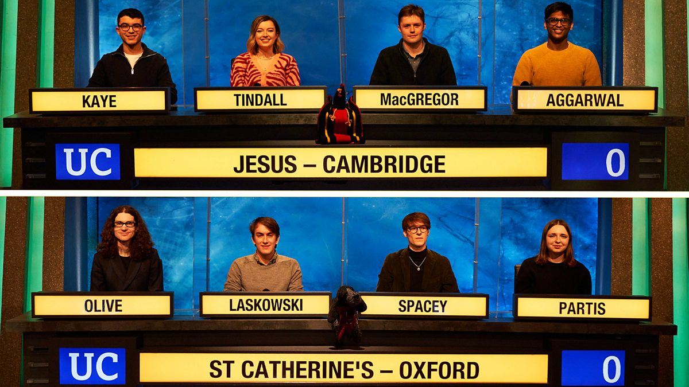

The TV quiz show [University Challenge](https://en.wikipedia.org/wiki/University_Challenge) is a competition between teams of university students. Each team consists of four students from one university – except for Cambridge and Oxford, which, rather than having one team for the whole university, instead compete separately as their constituent colleges. So, for example, the [current series](https://en.wikipedia.org/wiki/University_Challenge_2022%E2%80%9323) has 28 teams: 20 universities, 4 Cambridge colleges, and 4 Oxford colleges.

This has [been in the news](https://www.theguardian.com/tv-and-radio/2023/mar/26/bbc-rejects-charge-of-elitist-oxbridge-bias-in-university-challenge) recently: someone called Frank Coffield has repeatedly complained to the BBC, saying, “Why has the BBC allowed the format of this programme to treat all other universities in the UK apart from Oxbridge as second class?”

I don’t want here to get into questions about whether or not this is classist or elitist (nor if such elitism is good or bad). Rather, I’m interested in a narrower question: *Does competing as multiple colleges rather than the whole university increase or decrease the chance of an Oxbridge winner of the series?*

First, I want to convince you that the answer to this question is not obvious. To do this, consider replacing the normal quiz show format of University Challenge with one of two other formats:

* **University Coin-Toss:** In this show, Jeremy Paxman tosses a coin; if it’s heads, the team on the left wins, and if it’s tails, the team on the right wins. Clearly, this format is totally random, and each team entered has an equal chance of winning the series. So if Cambridge enters four college teams, it is four times as likely to win as a university that enters only one team.

* **University Heights:** In the show, Jeremy Paxman measures the height of each contestant, and the team with the highest total height wins. This game is completely deterministic. If Oxford want to win, they need to find their four tallest students and put them in the team. But it’s very unlikely that those four giant students all go to the same college, so Oxford will instead have to split up their best team into inferior shorter teams, and only the tallest of the shorter inferior college teams has any possibility of winning. So splitting up into college teams has decreased the ability of Oxford to win.

So really the question comes down to: Is University Challenge a random game, like University Coin-Toss, where multiple college teams gives you multiple chances to win? Or is University Challenge a completely reliable deterministic game, like University Heights, where having multiple college teams splits up and disperses the best university team? And how should we work out which one the real University Challenge is more like?

I don’t have a perfect answer to this question, but I have a couple of suggestions.

First, one could look for occasions where a pair of teams plays each other more than once. In “University Heights”, one of the two teams would win all the match-ups, whereas in “University Coin-Toss” you’d expect each team to win about half of the match-ups each. So you could look for repeat games and count up how many get the same result or the opposite result as the original.

This would work well for a competition where teams often re-play each other, like Premier Leage football, say, where each pair of teams plays twice. (The Premier League example is complicated by the common occurence of draws and possible home advantage, but let’s not get into that here.) However, although University Challenge does have various complicated “highest scoring loser” and “win two matches to proceed” rules, so it is *possible* for teams to play each other more than once, it does seem to be very rare – I think the organisers try to avoid rematches where possible. (In the [last complete series](https://en.wikipedia.org/wiki/University_Challenge_2021%E2%80%9322), Imperial narrowly beat Reading in a nail-biting final, having previously beaten them relatively comfortably in a very high scoring quarterfinal, but this was the only repeat match of the series.)

Instead, one could look for triples of teams that had each played each other: A and B had played each other, B and C had played each other, and C and A had played each other. Up to the labelling of the teams, there are two possibilities:

* **Transitive:** A beats B and C; B loses to A but beat C; C loses to both A and B. So A is the best team, B the middle team, and C the worst team.
* **Cyclic:** A beats B, and B beats C, but C beats A. So it seems that each team are equally good.

In “University Heights”, the triples would always be transitive. In “University Coin-Toss”, a moment with a sheet of paper and a pencil should convince you that triples would be transitive with probability 3/4 and cyclic with probability 1/4. So a competition with much higher than 3/4 of the triples being transitive is unlikely to completely random. Unfortunately, these triples seem to be pretty rare too: the most recent series had only two such triples. They were both transitive, but that would happen more than 50% of the time even under “University Coin-Toss”. 

One could also look at potential 4-cycles (A plays B, B plays C, C plays D, D plays A), 5-cycles, and so on. But a brief browse through a couple of years of University Challenge result suggests that 3-cycles may well be the sweet spot. So now the question is: how much patience do I have to go through old University Challenge results and find all the triples for all the previous series…?
