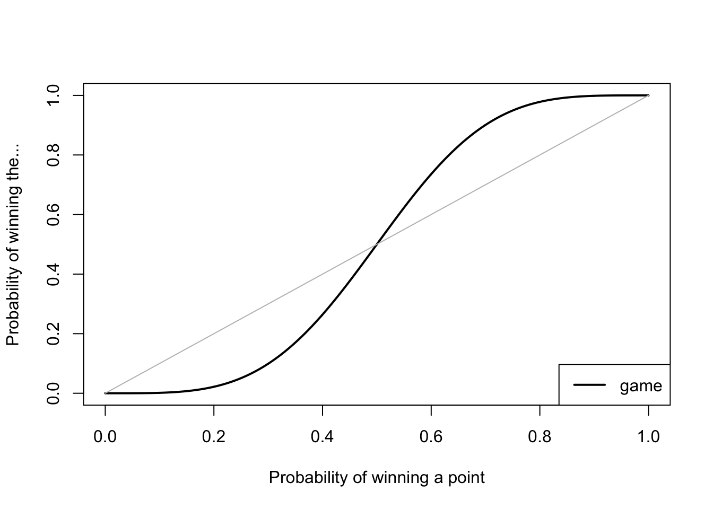
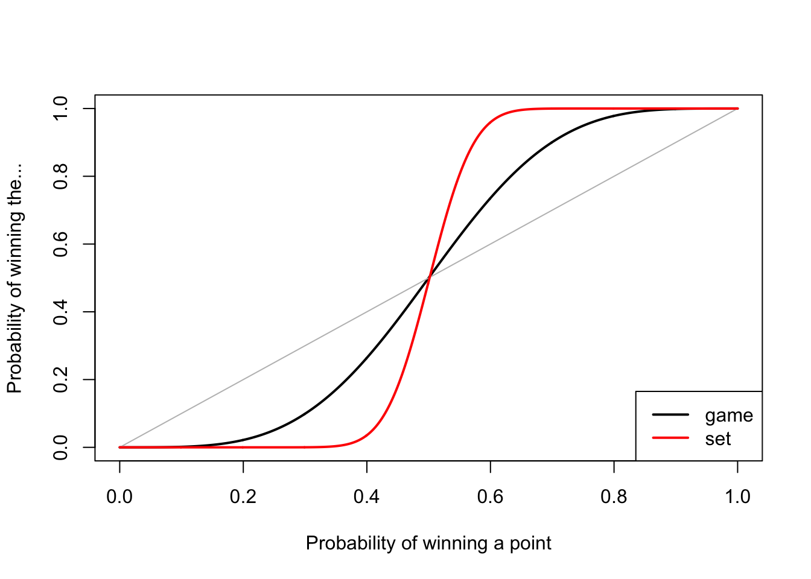
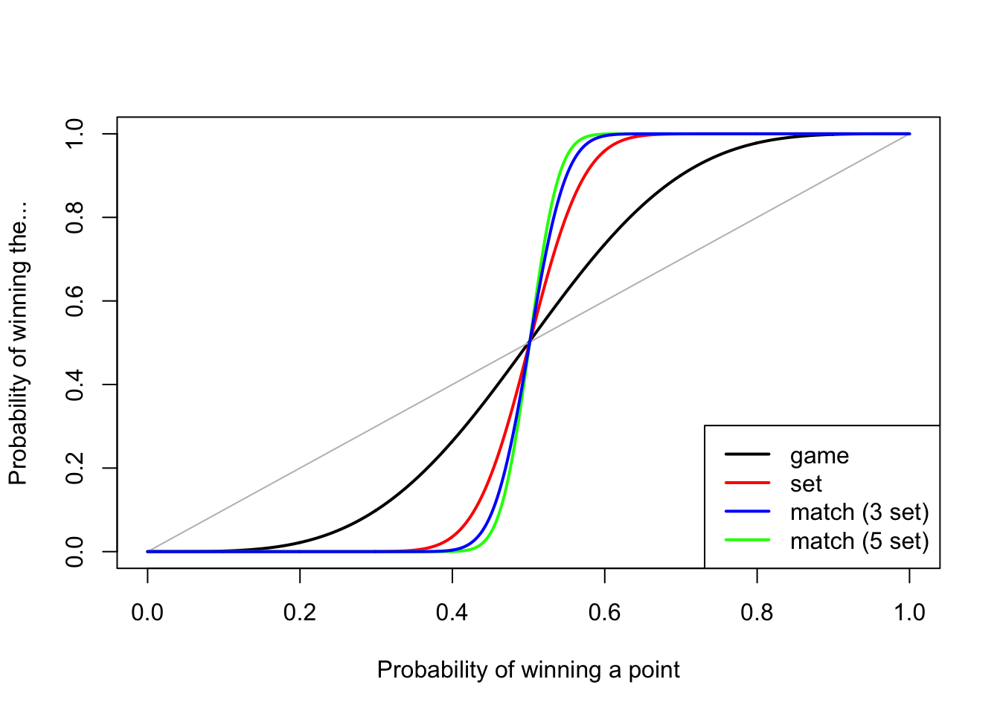
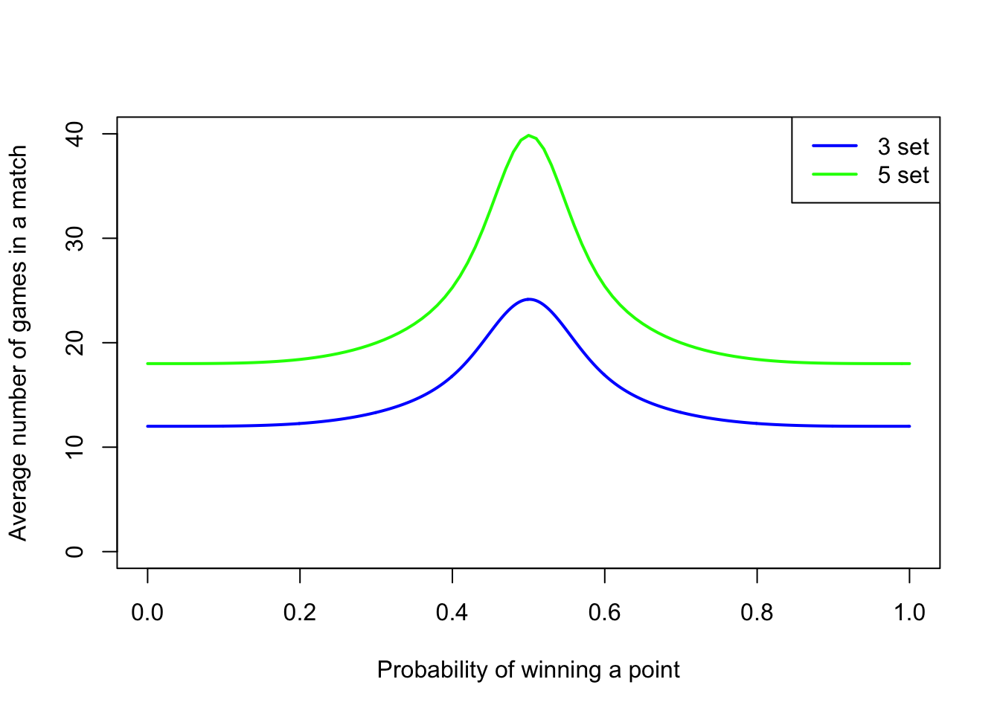

[Last night](https://www.theguardian.com/sport/2021/sep/11/emma-raducanu-makes-tennis-history-with-us-open-final-win), Emma Raducanu won her 19th and 20th consecutive sets at the US Open since the first qualifying round 18 days ago, and in doing so became Britain's first British woman to win a grand slam title since 1977.

It was also the first time I've watched a tennis match from first shot to last in quite a while – and probably the same for lots of other people too. And, of course, tennis scoring can be a bit complicated for the casual viewer. As someone I follow on Twitter wrote:

<blockquote class="twitter-tweet">
Whoever invented tennis scoring was definitely on acid.
&mdash; Hannah Al-Othman (@HannahAlOthman) <a href="https://twitter.com/HannahAlOthman/status/1436789026334388225?ref_src=twsrc%5Etfw">September 11, 2021</a></blockquote> 

This reminded me of a pretty famous maths problem: _If you have a probability $$p$$ of winning a point in tennis, what's the probability that you win a game?_

Recall that a "game" is, starting from 0 ("love") the first person to 4 points (denoted, for [obscure reasons](https://en.wikipedia.org/wiki/Tennis_scoring_system#History), "15", "30", "40", "game"), but you must win by 2 clear points. To keep track of the two clear points, if the game gets to 40-40 (that is, 3 points each), that's called "deuce". The player who wins the next point has "advantage" ("Advantage Raducanu" or "Advantage Fernandez", calls the umpire); if they win the next point, they win the game, while if the opposing player wins the next point, it returns to deuce again.

(I say a "pretty famous" maths problem, because I remember coming across it a couple of times in my teens, probably in pop-maths books. Then in 2002, it was a question in my Cambridge entrance interview. I hadn't memorised the exact solution or anything, but I could remember enough of the general process to be able to work smoothly through to the solution without errors or needing help. I aced the question, and I got in. It's interesting to wonder in what ways my life might be different now if I hadn't come across this tennis problem before the interview. There's got to be at least a chance I wouldn't be a maths lecturer now without it.)

### Game

What makes this an interesting maths problem is the "two clear points" rule, as tracked by deuce and advantage. This means that there's, mathematically speaking, no limit to how long a game might last: it could go deuce, advantage, deuce, advantage, deuce, advantage, ... (each advantage to either player) for an arbitrarily long time. (The second game of last night's Raducanu–Fernandez match had five deuces and five advantages before Raducanu broke serve.) So the non-boring part of the question is: _Once you get to deuce, what_ then _is the probability that you win the game?_

Remember that $$p$$ is the probability you win a point; it will be convenient to write $$q = 1 - p$$ for the probability you lose a point. Let $$d$$ be the probability you win the game starting from deuce. So from deuce, three things can happen:

*   You win the next two points, with probability $$p \times p = p^2$$. You then win the game.
*   You lose the next two points, with probability $$q \times q = q^2$$. You then lose the game.
*   You win one of the next two points: either win then lose or lose then win, with probability $$p \times q + q \times p = 2pq$$. You then return to deuce again, so your probability of winning the game is back to the $$d$$ that you started with.

Putting all this together, we have

$$
d = p^2\times 1 + 2pq \times d + q^2 \times 0 = p^2 + 2pqd .
$$

We can then solve this for $$d$$, to get

$$
d = \frac{p^2}{1 - 2pq}
$$

That solves the difficult/interesting part of the problem, Then it's straightforward but tiresome to turn this probability of winning a game from deuce into probability of winning the game from the start. A graph of the answer looks like this:

Note that having just a slightly better than 50:50 chance of winning each point gives you a much better than 50:50 chance of winning the whole game. For example, Raducanu won 54% of points last night (81 points out of 149), which would give you a 61% chance of winning each game – Raducanu actually won 63% of the games. (This is ignoring the very important issue of serving vs returning.)

### Set and match

You can similarly stretch this out to a whole set, again ignoring serving/returning, which is again mathematically tiresome but not mathematically difficult. Here, the effect that a small superiority in winning points leads to a bit superiority in winning sets is even more pronounced.

Unsurprisingly, for the whole match it's more extreme still – a 54% chance of winning a point gives you an 87% chance of winning the match, or 92% for a men's five-set match.

### Close matches are long matches

So why bother with the complicated scoring. I guess the main reason is a sort of psychological one. A "first to 81 points" match would get pretty samey, and when one player is at 80 points to 68, it's pretty clear who's going to win. Instead we have the excitement of who's going to win this game, then who's going to win this set, as smaller bits of excitement within the match. It also gives a player that falls behind a chance to catch up – a 6–0 set loss is no worse that 7–6, so you pick yourself up, dust yourself off, and get started again.

But one other reason, is that ensures that matches where one player dominates are over very quickly, while tight balanced matches will go on for longer. This extends exciting close matches, and also makes it more likely that the genuinely better player will win. (A slightly worse player has more chance of snatching a lucky win in a shorter match.)

That picture shows the average number of games in a match. We see that close matches, where the probability of wining a point is close to 0.5, are the longest games, on average.

My own solution: Start playing a minimum number of points; maybe 100. From then, as soon as one player has scored $$n/2 + \sqrt{n}$$ points out of $$n$$, we say that they're two standard deviations above 50:50, reject the null hypothesis that $$p = 0.5$$, and declare them the winner. I don't think it will catch on.

_[[This article](https://datagenetics.com/blog/august12018/index.html) was helpful for cheacking my calculations.]_
